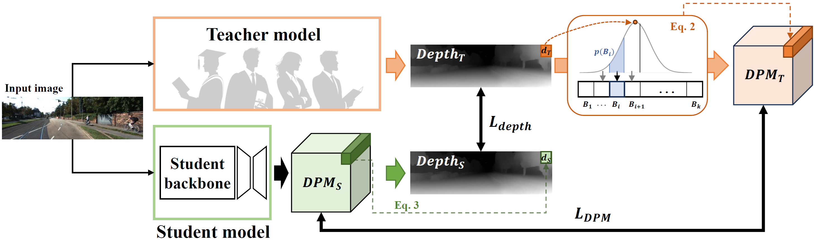

# TIE-KD

## Introduction
Monocular depth estimation (MDE) is essential for numerous applications yet is impeded by the substantial computational demands of accurate deep learning models. To mitigate this, we introduce a novel Teacher-Independent Explainable Knowledge Distillation (TIE-KD) framework that streamlines the knowledge transfer from complex teacher models to compact student networks, eliminating the need for architectural similarity. The cornerstone of TIE-KD is the Depth Probability Map (DPM), an explainable feature map that interprets the teacher's output, enabling feature-based knowledge distillation solely from the teacher's response. This approach allows for efficient student learning, leveraging the strengths of feature-based distillation. Extensive evaluation of the KITTI dataset indicates that TIE-KD not only outperforms conventional response-based KD methods but also demonstrates consistent efficacy across diverse teacher and student architectures. The robustness and adaptability of TIE-KD underscore its potential for applications requiring efficient and interpretable models, affirming its practicality for real-world deployment.

## Related paper
TIE-KD: Teacher-Independent and Explainable Knowledge Distillation for Monocular Depth Estimation [[Published Ver.](https://www.sciencedirect.com/science/article/pii/S0262885624002142)][[preprint(arxiv)](https://arxiv.org/abs/2402.14340)]
- [bibtex](https://drive.google.com/file/d/1vhyTBaOTzb2x2UQ64s1OTNPH9ZcnDnA-/view?usp=sharing)

## Installation

Please refer to [get_started.md](docs/get_started.md#installation) [(html)](docs/get_started.html) for installation and [dataset_prepare.md](docs/dataset_prepare.md#prepare-datasets) [(html)](docs/dataset_prepare.html) for dataset preparation.

## Get Started

We provide [train.md](docs/train.md) [(html)](docs/train.html) and [inference.md](docs/inference.md) [(html)](docs/inference.html) for the usage of this toolbox. 

<!-- In the future, there will be tutorials for [customizing dataset (TODO)](docs/tutorials/customize_datasets.md), [designing data pipeline (TODO)](docs/tutorials/data_pipeline.md), [customizing modules (TODO)](docs/tutorials/customize_models.md), and [customizing runtime (TODO)](docs/tutorials/customize_runtime.md). We also provide [training tricks (TODO)](docs/tutorials/training_tricks.md). -->

## Results and models for KITTI

### Teachers
| Model | Backbone | Train Epoch | Abs Rel | RMSE | Config | Download |
| :------: | :--------: | :----: | :--------------: | :------: | :------: | :--------: |
| Adabins  |  EfficientNetB5-AP  |  24   | 0.0593 | 2.3309 |  [config](configs/teachers/adabins_efnetb5ap_kitti_24e.py) |  [model](https://koreatechackr-my.sharepoint.com/:u:/g/personal/bluekds_koreatech_ac_kr/Ecb81qU-z39AvaUeN-Up1kcBrWYcowajq83eZAlobCcxNg?e=klJ65F)
| BTS  |  ResNet-50  |  24   | 0.0586 | 2.4798 |  [config](configs/teachers/bts_r50_kitti_24e_b4.py) | [model](https://koreatechackr-my.sharepoint.com/:u:/g/personal/bluekds_koreatech_ac_kr/EXkshDfzK1BPqpLSIX4LgtoBusnW1t4HfyP6yUZsPsw4fQ?e=lftblO)
| Depthformer | SwinL-w7-22k   |  24   | 0.0513 | 2.1038 |  [config](configs/teachers/depthformer_swinl_22k_w7_kitti.py) | [model](https://koreatechackr-my.sharepoint.com/:u:/g/personal/bluekds_koreatech_ac_kr/EQ2uVeyE5nBMp0HxQ8qhBMwBGUdXnjK4bdU2P7cBb6VJBA?e=r1CWgY)

### Students

| Teacher | Method | Loss | Backbone | Train Epoch | Abs Rel | RMSE | Config | Download |
| :------: | :------: | ------ | :--------: | :----: | :--------------: | :------: |  :------: | :--------: |
| - | Baseline | SI | MobileNetV2   |  24   | 0.0663 | 2.5625 |  [config](configs/students/baseline_mobile2_KITTI.py) | [model](https://koreatechackr-my.sharepoint.com/:u:/g/personal/bluekds_koreatech_ac_kr/EdlFQw-fK2VFtRthjOBrB-8B-zKFnbCzdXIf4gE3rFsDOA?e=VeoX5W)
| - | Baseline | SI | ResNet18   |  24   | 0.0634 | 2.5311 |  [config](configs/students/baseline_r18_KITTI.py) | [model](https://koreatechackr-my.sharepoint.com/:u:/g/personal/bluekds_koreatech_ac_kr/EfuV2bwuaEJLrcwEf8nGHkcBBw5Xjpht-hdoSx_JJxeHlQ?e=JwC4ce)
| - | Baseline | SI | ResNet50   |  24   | 0.0605 | 2.4159 |  [config](configs/students/baseline_r50_KITTI.py) | [model](https://koreatechackr-my.sharepoint.com/:u:/g/personal/bluekds_koreatech_ac_kr/EXsoMPQO3ZpBt5Tn2htCV5kBoBtrem4zJNFn0hz2OyyO5A?e=jDqzuY)
| Adabins | Res-KD | SSIM | MobileNetV2   |  24   | 0.0697 | 2.5639 |  [config](configs/students/Res-KD_adabins_SSIM_KITTI) | [model](https://koreatechackr-my.sharepoint.com/:u:/g/personal/bluekds_koreatech_ac_kr/EQAIaefdPctKsPXtEJl2w8MBF2O-BbB2EKeHBaCILXdMKQ?e=145gRk)
| Adabins | Res-KD | MSE | MobileNetV2   |  24   | 0.0786 | 2.6964 |  [config](configs/students/Res-KD_adabins_MSE_KITTI.py) | [model](https://koreatechackr-my.sharepoint.com/:u:/g/personal/bluekds_koreatech_ac_kr/EXsG2foZNgxNhbo_E_vWoREBKRmWYTQ0j1zIeGemOMt6cg?e=doYEUC)
| Adabins | Res-KD | SI | MobileNetV2   |  24   | 0.0739 | 2.7371 |  [config](configs/students/Res-KD_adabins_SI_KITTI.py) | [model](https://koreatechackr-my.sharepoint.com/:u:/g/personal/bluekds_koreatech_ac_kr/EevDYCQIxrdOlXf1eUW_Iz4B2VGsSobxUXr84MkeHZtxQA?e=KFsOCN)
| Adabins | Res-KD | SSIM, SI | MobileNetV2   |  24   | 0.0701 | 2.5833 |  [config](configs/students/Res-KD_adabins_SSIM_SI_KITTI.py) | [model](https://koreatechackr-my.sharepoint.com/:u:/g/personal/bluekds_koreatech_ac_kr/EZl-v1hWUPBGuceip2W2jocBchplWNokoCfKsxRYEcFTfw?e=Kn0oQL)
| Adabins | Res-KD | SSIM, MSE | MobileNetV2   |  24   | 0.0808 | 2.6943 |  [config](configs/students/Res-KD_adabins_SSIM_MSE_KITTI.py) | [model](https://koreatechackr-my.sharepoint.com/:u:/g/personal/bluekds_koreatech_ac_kr/EQ-sExqXMlZCgVx5CSx7NG8BXnHbDMLLYv9fJG9EnH6fKg?e=BwHK0S)
| Adabins | TIE-KD | L_DPM | MobileNetV2   |  24   | 0.0718 | 2.5433 |  [config](configs/students/TIE-KD_adabins_L_DPM_KITTI.py) | [model](https://koreatechackr-my.sharepoint.com/:u:/g/personal/bluekds_koreatech_ac_kr/EU0exIKkkOJNllhctrWzLzoBa7dRZCp8lmqlpUVZ8Ta0Uw?e=LfMh3e)
| Adabins | TIE-KD | L_DEPTH | MobileNetV2   |  24   | 0.0696 | 2.4646 |  [config](configs/students/TIE-KD_adabins_L_DEPTH_KITTI.py) | [model](https://koreatechackr-my.sharepoint.com/:u:/g/personal/bluekds_koreatech_ac_kr/ESTNec4BW-9AvS-58zw7rZMBzDwr1SXgjRcqdSq4qmVRUA?e=FekmUV)
| Adabins | TIE-KD | L_DPM, L_DEPTH | MobileNetV2   |  24   | 0.0654 | 2.4315 |  [config](configs/students/TIE-KD_adabins_NYU.py) | [model](https://koreatechackr-my.sharepoint.com/:u:/g/personal/bluekds_koreatech_ac_kr/ETLWpOT1trtPnXGnxfk-zhMBaIKOWV2SQNPsm5Sr0-QBiQ?e=7aJJLY)
| BTS | Res-KD | SSIM | MobileNetV2   |  24   | 0.0697 | 2.6357 |  [config](configs/students/Res-KD_bts_SSIM_NYU.py) | [model](https://koreatechackr-my.sharepoint.com/:u:/g/personal/bluekds_koreatech_ac_kr/Ee6A8elEbI5IhUtRKuNw2TEBa8pZ_4TF8uTc4MQxNFVHCA?e=F04AYh)
| BTS | Res-KD | MSE | MobileNetV2   |  24   | 0.0820 | 2.7440 |  [config](configs/students/Res-KD_bts_MSE_NYU.py) | [model](https://koreatechackr-my.sharepoint.com/:u:/g/personal/bluekds_koreatech_ac_kr/EbyjZaRiWptIiYupsjX1ujgBDq4Ru5CcXNIql2A4Wm12_w?e=dp8Yyf)
| BTS | Res-KD | SI | MobileNetV2   |  24   | 0.0782 | 2.8106 |  [config](configs/students/Res-KD_bts_SI_NYU.py) | [model](https://koreatechackr-my.sharepoint.com/:u:/g/personal/bluekds_koreatech_ac_kr/EQ13TgBbAmpBoLW9H1A7GYwBCo8v8m3mE9HpRXeM4FChRg?e=dFY09A)
| BTS | Res-KD | SSIM, SI | MobileNetV2   |  24   | 0.0690 | 2.6168 |  [config](configs/students/Res-KD_bts_SSIM_SI_NYU.py) | [model](https://koreatechackr-my.sharepoint.com/:u:/g/personal/bluekds_koreatech_ac_kr/ESK8UBanBMJBqL51ZHqjEfYBuJB_dCWPe1fMptFTAmCthw?e=Q2oZyo)
| BTS | Res-KD | SSIM, MSE | MobileNetV2   |  24   | 0.0914 | 2.7983 |  [config](configs/students/Res-KD_bts_SSIM_MSE_NYU.py) | [model](https://koreatechackr-my.sharepoint.com/:u:/g/personal/bluekds_koreatech_ac_kr/EaTPyGiES6FBmZuF2Dc8GlQBr_sGLK9vX7BQ1bOgxXuLZw?e=oN3fHC)
| BTS | TIE-KD | L_DPM | MobileNetV2   |  24   | 0.0722 | 2.6459 |  [config](configs/students/TIE-KD_bts_L_DPM_KITTI.py) | [model](https://koreatechackr-my.sharepoint.com/:u:/g/personal/bluekds_koreatech_ac_kr/EZ_seiqDCBdNgCfhgGcCb_UBSVPuHDZsPjRFKOz2b8PuEA?e=mpDP3F)
| BTS | TIE-KD | L_DEPTH | MobileNetV2   |  24   | 0.0679 | 2.5694 |  [config](configs/students/TIE-KD_bts_L_DEPTH_KITTI.py) | [model](https://koreatechackr-my.sharepoint.com/:u:/g/personal/bluekds_koreatech_ac_kr/EUBFNOIs8fpDs6v3irbXSuAB19xZLPFhmIW5Kvq6e0MDKA?e=L32m1Z)
| BTS | TIE-KD | L_DPM, L_DEPTH | MobileNetV2   |  24   | 0.0656 | 2.4984 |  [config](configs/students/TIE-KD_bts_KITTI.py) | [model](https://koreatechackr-my.sharepoint.com/:u:/g/personal/bluekds_koreatech_ac_kr/EbyIvRHSP5dFsLLb3P0iwHMByTrMp47qKZTXItwmjnl0rg?e=FOsPrf)
| Depthformer | Res-KD | SSIM | MobileNetV2   |  24   | 0.0692 | 2.5009 |  [config](configs/students/Res-KD_depthformer_SSIM_KITTI.py) | [model](https://koreatechackr-my.sharepoint.com/:u:/g/personal/bluekds_koreatech_ac_kr/EW9RsnlUfeJMlNdrho_S2hQBaoOAJMjjeDKxM5AvKGHrhg?e=ZY12n9)
| Depthformer | Res-KD | MSE | MobileNetV2   |  24   | 0.0805 | 2.6029 |  [config](configs/students/Res-KD_depthformer_MSE_KITTI.py) | [model](https://koreatechackr-my.sharepoint.com/:u:/g/personal/bluekds_koreatech_ac_kr/Ebel69AC67NBuvXT79QU7EsBuc44UA6auzJZaOvAevVr-A?e=4iXN6o)
| Depthformer | Res-KD | SI | MobileNetV2   |  24   | 0.0724 | 2.6717 |  [config](configs/students/Res-KD_depthformer_SI_KITTI.py) | [model](https://koreatechackr-my.sharepoint.com/:u:/g/personal/bluekds_koreatech_ac_kr/Ef0cvkKWWoxInt_jYy-T2XsButjFx8fczBexYaZcZhic0g?e=UmjbWj)
| Depthformer | Res-KD | SSIM, SI | MobileNetV2   |  24   | 0.0682 | 2.5709 |  [config](configs/students/Res-KD_depthformer_SSIM_SI_KITTI.py) | [model](https://koreatechackr-my.sharepoint.com/:u:/g/personal/bluekds_koreatech_ac_kr/EXqhcQ4_WkZMnbD7Wx128F8BE7gKB-d-y7BZzSLqbXD5-Q?e=3TNF39)
| Depthformer | Res-KD | SSIM, MSE | MobileNetV2   |  24   | 0.0770 | 2.6391 |  [config](configs/students/Res-KD_depthformer_SSIM_MSE_KITTI.py) | [model](https://koreatechackr-my.sharepoint.com/:u:/g/personal/bluekds_koreatech_ac_kr/EdbhZqBhyH1Eu0yb_SmY6lQBmcadBzqVZtV9j5Tl9dD_7g?e=0cqeQf)
| Depthformer | TIE-KD | L_DPM | MobileNetV2   |  24   | 0.0713 | 2.5241 |  [config](configs/students/TIE-KD_depthformer_L_DPM_KITTI.py) | [model](https://koreatechackr-my.sharepoint.com/:u:/g/personal/bluekds_koreatech_ac_kr/EX6nZZ5-zVRGtE9M78QkxiMBL9n79QoSosRqoGGxfpW34A?e=CihhaV)
| Depthformer | TIE-KD | L_DEPTH | MobileNetV2   |  24   | 0.0698 | 2.4805 |  [config](configs/students/TIE-KD_depthformer_L_DEPTH_KITTI.py) | [model](https://koreatechackr-my.sharepoint.com/:u:/g/personal/bluekds_koreatech_ac_kr/Ef9iFznvR91BtmSub7kBs3gBKWSUfSgbmvFwmqlCdPDcGw?e=hQ3bUC)
| Depthformer | TIE-KD | L_DPM, L_DEPTH | MobileNetV2   |  24   | 0.0657 | 2.4402 |  [config](configs/students/TIE-KD_depthformer_KITTI.py) | [model](https://koreatechackr-my.sharepoint.com/:u:/g/personal/bluekds_koreatech_ac_kr/EUo6JnBH51tAjObs-XKn9WoByx1IzhX4W_q0aogSUwuqsQ?e=8mBNkU)

| Teacher | Method | Loss | Backbone | Train Epoch | Abs Rel | RMSE | Config | Download |
| :------: | :------: | ------ | :--------: | :----: | :--------------: | :------: |  :------: | :--------: |
| Adabins | TIE-KD | L_DPM, L_DEPTH | ResNet18   |  24   | 0.0628 | 2.4029 |  [config](configs/students/TIE-KD_adabins_r18_KITTI.py) | [model](https://koreatechackr-my.sharepoint.com/:u:/g/personal/bluekds_koreatech_ac_kr/ETTAIZSmXwlMr1T9q_oDIPcBuv4KvVDtxQ38LtKap-2Clw?e=O6i1zM)
| Adabins | TIE-KD | L_DPM, L_DEPTH | ResNet50   |  24   | 0.0597 | 2.3060 |  [config](configs/students/TIE-KD_adabins_r50_KITTI.py) | [model](https://koreatechackr-my.sharepoint.com/:u:/g/personal/bluekds_koreatech_ac_kr/EYapE9VEBcdNjQ1WAPScazEBdHZx6HXu6jk50YQnCEieKQ?e=8OuOd6)
| BTS | TIE-KD | L_DPM, L_DEPTH | ResNet18   |  24   | 0.0635 | 2.4527 |  [config](configs/students/TIE-KD_bts_r18_KITTI.py) | [model](https://koreatechackr-my.sharepoint.com/:u:/g/personal/bluekds_koreatech_ac_kr/EYQX3OW6-HxEt3ok1eYrevwBIli6jgOKD7W0VdtdYYhoow?e=V5lpjx)
| BTS | TIE-KD | L_DPM, L_DEPTH | ResNet50   |  24   | 0.0615 | 2.4019 |  [config](configs/students/TIE-KD_bt_r50_KITTI.py) | [model](https://koreatechackr-my.sharepoint.com/:u:/g/personal/bluekds_koreatech_ac_kr/ETV21K5bhqJBjdFnFJJv0r0BcPFuWQxZIZ-NHZpnYgTnMA?e=eOt7za)
| Depthformer | TIE-KD | L_DPM, L_DEPTH | ResNet18   |  24   | 0.0624 | 2.3963 |  [config](configs/students/TIE-KD_depthformer_r18_KITTI.py) | [model](https://koreatechackr-my.sharepoint.com/:u:/g/personal/bluekds_koreatech_ac_kr/EY6q05u-JHlGsfFv4YksyykB8-mWwbFKECw7CbdAR0jlug?e=b96bbO)
| Depthformer | TIE-KD | L_DPM, L_DEPTH | ResNet50   |  24   | 0.0586 | 2.2821 |  [config](configs/students/TIE-KD_depthformer_r50_KITTI.py) | [model](https://koreatechackr-my.sharepoint.com/:u:/g/personal/bluekds_koreatech_ac_kr/EQg4v3Uj4BVHrReq_2QK19wBYIN4XR9pumuHTsct6bFqwg?e=NFYb7a)

## Results and models for NYU

### Teachers
| Model | Backbone | Train Epoch | Abs Rel | RMSE | Config | Download |
| :------: | :--------: | :----: | :--------------: | :------: | :------: | :--------: |
| Adabins  |  EfficientNetB5-AP  |  24   | 0.106 | 0.368 |  [config](configs/teachers/adabins_efnetb5ap_nyu_24e.py) |  [model](https://koreatechackr-my.sharepoint.com/:u:/g/personal/bluekds_koreatech_ac_kr/ERoNYzVegBtHho1K2r_3nAgBzlIM1zfviNaHIU0vkLKI_g?e=XkIkAE)
| BTS  |  ResNet-50  |  24   | 0.114 | 0.41 |  [config](configs/teachers/bts_r50_nyu_24e.py) | [model](https://koreatechackr-my.sharepoint.com/:u:/g/personal/bluekds_koreatech_ac_kr/ESL4vnjBQWVMoC6N7xTsgckBdHb3nGgH8wJYCx6tReNLmQ?e=SAaHIN)
| Depthformer | SwinL-w7-22k   |  24   | 0.094 | 0.33 |  [config](configs/teachers/depthformer_swinl_22k_w7_nyu.py) | [model](https://koreatechackr-my.sharepoint.com/:u:/g/personal/bluekds_koreatech_ac_kr/EX1sw8lq_z1LmwslST6NG7UB-8333LpAsJzE2nbW6_jsJA?e=vTr6Ik)

### Students

| Teacher | Method | Loss | Backbone | Train Epoch | Abs Rel | RMSE | Config | Download |
| :------: | :------: | ------ | :--------: | :----: | :--------------: | :------: |  :------: | :--------: |
| - | Baseline | SI | MobileNetV2   |  24   | 0.1661 | 0.5578 |  [config](configs/students/baseline_mobile2_NYU.py) | [model](https://koreatechackr-my.sharepoint.com/:u:/g/personal/bluekds_koreatech_ac_kr/EY4gdSIOGdtLnN98e2r8a2cBOMeXJyu_HJY_2wxIHImQFg?e=qWKBC0)
| - | Baseline | SI | ResNet18   |  24   | 0.1454 | 0.4907 |  [config](configs/students/baseline_r18_NYU.py) | [model](https://koreatechackr-my.sharepoint.com/:u:/g/personal/bluekds_koreatech_ac_kr/EQ0nNra34a1MqvlcRJasGC8BWroPL2RwGjNCchJQ0TLlrA?e=eVe8HL)
| - | Baseline | SI | ResNet50   |  24   | 0.1445 | 0.4810 |  [config](configs/students/baseline_r50_NYU.py) | [model](https://koreatechackr-my.sharepoint.com/:u:/g/personal/bluekds_koreatech_ac_kr/EdkdTnIjCwNOnMpkPE0hGIABQbgH4m0gaUL8vjQWt4XhKQ?e=YEcf30)
| Adabins | Res-KD | SSIM | MobileNetV2   |  24   | 0.1849 | 0.5867 |  [config](configs/students/Res-KD_adabins_SSIM_NYU.py) | [model](https://koreatechackr-my.sharepoint.com/:u:/g/personal/bluekds_koreatech_ac_kr/EfpDYdfXiPNEuAdoLHuQsbUB5mUklPqmW0D_UdrFDk4_kQ?e=BHZZ1V)
| Adabins | Res-KD | MSE | MobileNetV2   |  24   | 0.1843 | 0.5760 |  [config](configs/students/Res-KD_adabins_MSE_NYU.py) | [model](https://koreatechackr-my.sharepoint.com/:u:/g/personal/bluekds_koreatech_ac_kr/Edlg2_qmRo1LjFBCIHbCeMoBFdOIV4crQbznlrd61SkN0w?e=VEU74f)
| Adabins | Res-KD | SI | MobileNetV2   |  24   | 0.1769 | 0.5623 |  [config](configs/students/Res-KD_adabins_SI_NYU.py) | [model](https://koreatechackr-my.sharepoint.com/:u:/g/personal/bluekds_koreatech_ac_kr/EX1FmBwBRuZEkiUOdgUVx_EBHR58aP1WqdZs2pfziHz5EA?e=7Pjc4C)
| Adabins | Res-KD | SSIM, SI | MobileNetV2   |  24   | 0.1704 | 0.5587 |  [config](configs/students/Res-KD_adabins_SSIM_SI_NYU.py) | [model](https://koreatechackr-my.sharepoint.com/:u:/g/personal/bluekds_koreatech_ac_kr/EdVfBOdf5XVGqMEvuYhIdRABLUXQfgkYme5nNDPAq1uRuA?e=c03dbg)
| Adabins | Res-KD | SSIM, MSE | MobileNetV2   |  24   | 0.1865 | 0.5818 |  [config](configs/students/Res-KD_adabins_SSIM_MSE_NYU.py) | [model](https://koreatechackr-my.sharepoint.com/:u:/g/personal/bluekds_koreatech_ac_kr/EY6Jqy8Wre1AuEgz-iMtHGEB6QN8sa9k3Vt7ffUuaBFBYQ?e=R1Dfa7)
| Adabins | TIE-KD | L_DPM | MobileNetV2   |  24   | 0.1887 | 0.6006 |  [config](configs/students/TIE-KD_adabins_L_DPM_NYU.py) | [model](https://koreatechackr-my.sharepoint.com/:u:/g/personal/bluekds_koreatech_ac_kr/EdgvzDjPeslNtm_9Ehth6uEB9JB-raNlMlLCeYqBzc_fWw?e=aOi5hb)
| Adabins | TIE-KD | L_DEPTH | MobileNetV2   |  24   | 0.1840 | 0.5822 |  [config](configs/students/TIE-KD_adabins_L_DEPTH_NYU.py) | [model](https://koreatechackr-my.sharepoint.com/:u:/g/personal/bluekds_koreatech_ac_kr/EbYdok_L189Gp5v0CXDWT4IB3-b99_XnqC24sYhB_J4Uww?e=x8TZBs)
| Adabins | TIE-KD | L_DPM, L_DEPTH | MobileNetV2   |  24   | 0.1812 | 0.5688 |  [config](configs/students/TIE-KD_adabins_NYU.py) | [model](https://koreatechackr-my.sharepoint.com/:u:/g/personal/bluekds_koreatech_ac_kr/ETn59fNaXLtGv5NN6zOWnqEBTNBC2oJGSePmxWlQAUESTA?e=Ctp42L)
| BTS | Res-KD | SSIM | MobileNetV2   |  24   | 0.1798 | 0.5752 |  [config](configs/students/Res-KD_bts_SSIM_NYU.py) | [model](https://koreatechackr-my.sharepoint.com/:u:/g/personal/bluekds_koreatech_ac_kr/EUeBHnBX0RNMnFZqp7o-jX4BT8UOBGRX6OZ-4a6iYd2TzA?e=EvJMOC)
| BTS | Res-KD | MSE | MobileNetV2   |  24   | 0.1788 | 0.5708 |  [config](configs/students/Res-KD_bts_MSE_NYU.py) | [model](https://koreatechackr-my.sharepoint.com/:u:/g/personal/bluekds_koreatech_ac_kr/EffpNIBmsXVOkwcR1BEQfCoBFWxL7y9xs3ETNm1wMeO4tg?e=uVnGCF)
| BTS | Res-KD | SI | MobileNetV2   |  24   | 0.1719 | 0.5569 |  [config](configs/students/Res-KD_bts_SI_NYU.py) | [model](https://koreatechackr-my.sharepoint.com/:u:/g/personal/bluekds_koreatech_ac_kr/EUoc0wBlJoNEgrWxCAfK4eMBBPCQytkT4LX5LG3WncMVWQ?e=AZOc0u)
| BTS | Res-KD | SSIM, SI | MobileNetV2   |  24   | 0.1704 | 0.5591 |  [config](configs/students/Res-KD_bts_SSIM_SI_NYU.py) | [model](https://koreatechackr-my.sharepoint.com/:u:/g/personal/bluekds_koreatech_ac_kr/EdVfBOdf5XVGqMEvuYhIdRABLUXQfgkYme5nNDPAq1uRuA?e=pcrIil)
| BTS | Res-KD | SSIM, MSE | MobileNetV2   |  24   | 0.1789 | 0.5704 |  [config](configs/students/Res-KD_bts_SSIM_MSE_NYU.py) | [model](https://koreatechackr-my.sharepoint.com/:u:/g/personal/bluekds_koreatech_ac_kr/EbbMiLCgJLtKiHYsRllHKGoB_9c1eoOiIJuoMkx5zxYEqA?e=o1zksC)
| BTS | TIE-KD | L_DPM | MobileNetV2   |  24   | 0.1831 | 0.5989 |  [config](configs/students/TIE-KD_bts_L_DPM_NYU.py) | [model](https://koreatechackr-my.sharepoint.com/:u:/g/personal/bluekds_koreatech_ac_kr/EQw0UTqMVstPoaqEh7SXuC0Ba6qMkpOCXBp_Fiwmw_9E7A?e=6nAG9t)
| BTS | TIE-KD | L_DEPTH | MobileNetV2   |  24   | 0.2445 | 0.6241 |  [config](configs/students/TIE-KD_bts_L_DEPTH_NYU.py) | [model](https://koreatechackr-my.sharepoint.com/:u:/g/personal/bluekds_koreatech_ac_kr/EfeaFwFH3o1Os0pCgfZFvnkBx3wSrCVTXu-D4Ujzz509Ew?e=YlfTDG)
| BTS | TIE-KD | L_DPM, L_DEPTH | MobileNetV2   |  24   | 0.1778 | 0.5696 |  [config](configs/students/TIE-KD_bts_NYU.py) | [model](https://koreatechackr-my.sharepoint.com/:u:/g/personal/bluekds_koreatech_ac_kr/ESlJU2ZVQTZKn1VQJPqFDFUB3nqV9peJsRmXkdnesqGG7Q?e=fSsjCR)
| Depthformer | Res-KD | SSIM | MobileNetV2   |  24   | 0.1774 | 0.5704 |  [config](configs/students/Res-KD_depthformer_SSIM_NYU.py) | [model](https://koreatechackr-my.sharepoint.com/:u:/g/personal/bluekds_koreatech_ac_kr/EfHr5lieop1CkiNtpx4x0KABXK2ti4ltoxPISIbCuRhQPA?e=vGc38x)
| Depthformer | Res-KD | MSE | MobileNetV2   |  24   | 0.1789 | 0.5662 |  [config](configs/students/Res-KD_depthformer_MSE_NYU.py) | [model](https://koreatechackr-my.sharepoint.com/:u:/g/personal/bluekds_koreatech_ac_kr/EaIy35-HjChDgpLhFEaY89MBMWFmDAWLSyrCUx8gWQiydQ?e=BjYixH)
| Depthformer | Res-KD | SI | MobileNetV2   |  24   | 0.1727 | 0.5575 |  [config](configs/students/Res-KD_depthformer_SI_NYU.py) | [model](https://koreatechackr-my.sharepoint.com/:u:/g/personal/bluekds_koreatech_ac_kr/Ef64MtneJwZPi67a31bEK_YBlKFamjr0miScl8Rcf9Fzvw?e=gdEnuQ)
| Depthformer | Res-KD | SSIM, SI | MobileNetV2   |  24   | 0.1703 | 0.5579 |  [config](configs/students/Res-KD_depthformer_SSIM_SI_NYU.py) | [model](https://koreatechackr-my.sharepoint.com/:u:/g/personal/bluekds_koreatech_ac_kr/ETQrN02_aFVIkdkIyhAbvCoBFwypZNYUrzYruyd7OEK3Rw?e=t1BDbO)
| Depthformer | Res-KD | SSIM, MSE | MobileNetV2   |  24   | 0.1807 | 0.5703 |  [config](configs/students/Res-KD_depthformer_SSIM_MSE_NYU.py) | [model](https://koreatechackr-my.sharepoint.com/:u:/g/personal/bluekds_koreatech_ac_kr/ERi7M3OVitxHtC82cxxmSZABu3XF8pZ8-h791PQSak5XcA?e=MGYv88)
| Depthformer | TIE-KD | L_DPM | MobileNetV2   |  24   | 0.1857 | 0.6051 |  [config](configs/students/TIE-KD_depthformer_L_DPM_NYU.py) | [model](https://koreatechackr-my.sharepoint.com/:u:/g/personal/bluekds_koreatech_ac_kr/Ebew4T5HgehKp6YkHsf5PUMBEQ_AgJ20INbht57ckDAj5A?e=KOC9HH)
| Depthformer | TIE-KD | L_DEPTH | MobileNetV2   |  24   | 0.1854 | 0.5650 |  [config](configs/students/TIE-KD_depthformer_L_DEPTH_NYU.py) | [model](https://koreatechackr-my.sharepoint.com/:u:/g/personal/bluekds_koreatech_ac_kr/ERngzPVEwWhGmmh0RQBKerMBhg_qaKQ0nc1FeF3dNfBQ2A?e=TagMwT)
| Depthformer | TIE-KD | L_DPM, L_DEPTH | MobileNetV2   |  24   | 0.1800 | 0.5746 |  [config](configs/students/TIE-KD_depthformer_NYU.py) | [model](https://koreatechackr-my.sharepoint.com/:u:/g/personal/bluekds_koreatech_ac_kr/EXjeLsX-E71Kjarf_PyPSLAB39DVUYZ_Sfov7eeFI_fSRA?e=L8eRsE)

| Teacher | Method | Loss | Backbone | Train Epoch | Abs Rel | RMSE | Config | Download |
| :------: | :------: | ------ | :--------: | :----: | :--------------: | :------: |  :------: | :--------: |
| Adabins | TIE-KD | L_DPM, L_DEPTH | ResNet18   |  24   | 0.1630 | 0.5141 |  [config](configs/students/TIE-KD_adabins_r18_NYU.py) | [model](https://koreatechackr-my.sharepoint.com/:u:/g/personal/bluekds_koreatech_ac_kr/EbPziIUxmMdGrw1gXlqvMAwBCYyhPznt_ofDy_AeonF_LA?e=8bQVIS)
| Adabins | TIE-KD | L_DPM, L_DEPTH | ResNet50   |  24   | 0.1565 | 0.5005 |  [config](configs/students/TIE-KD_adabins_r50_NYU.py) | [model](https://koreatechackr-my.sharepoint.com/:u:/g/personal/bluekds_koreatech_ac_kr/ETH9R1t4wnJJs-FCc1XfGDMBcPxgbpWD9jHBiz8BEQWNZw?e=poN73j)
| BTS | TIE-KD | L_DPM, L_DEPTH | ResNet18   |  24   | 0.1550 | 0.5025 |  [config](configs/students/TIE-KD_bts_r18_NYU.py) | [model](https://koreatechackr-my.sharepoint.com/:u:/g/personal/bluekds_koreatech_ac_kr/ET_eEekYvHxJrMUgdTfeqNcBrKd9VcctyyQTrRCwYZPuXA?e=8L63Bi)
| BTS | TIE-KD | L_DPM, L_DEPTH | ResNet50   |  24   | 0.1501 | 0.4963 |  [config](configs/students/TIE-KD_bts_r50_NYU.py) | [model](https://koreatechackr-my.sharepoint.com/:u:/g/personal/bluekds_koreatech_ac_kr/ETepP5haF3pFnuB8Zeb1jVsBIlD43NgYEhgTW2R2-FR40Q?e=9ZyRgL)
| Depthformer | TIE-KD | L_DPM, L_DEPTH | ResNet18   |  24   | 0.1563 | 0.5059 |  [config](configs/students/TIE-KD_depthformer_r18_NYU.py) | [model](https://koreatechackr-my.sharepoint.com/:u:/g/personal/bluekds_koreatech_ac_kr/ESbb2HX_JR9Picridqhsfi8BL-2gKh7LYxZJN9eLh9q9JA?e=OfhgtK)
| Depthformer | TIE-KD | L_DPM, L_DEPTH | ResNet50   |  24   | 0.1514 | 0.4976 |  [config](configs/students/TIE-KD_depthformer_r50_NYU.py) | [model](https://koreatechackr-my.sharepoint.com/:u:/g/personal/bluekds_koreatech_ac_kr/EVWNgBSLp5FNqIrstRGGgDMBaHqFaDIRbGS7-3nfy3gR5Q?e=1kYvEu)

## Viewer
We provide a viewer that can simultaneously check the results of different methods for three models.
- Move between images with '←' and '→' keys
- Display diff of other images for that image with 1, 2, 3, 4, 5, 6, 7, 8, 9 numeric keys (press the same button again to toggle back)

|[AdaBins](https://hpc-lab-koreatech.github.io/TIE-KD?targets=Teacher_adabins*ver919_kitti_adabins_cal_range_w0.1_beta_4*ver925_base_up7*ver650_KD_SSIM*ver652_res-kd_mobile_mse_adabins*ver651_res-kd_mobile_SI_adabins*ver659_KD_SSIM_SIG*ver912_res-kd_mobile_SSIM_mse_adabins)|
|[BTS](https://hpc-lab-koreatech.github.io/TIE-KD?targets=Teacher_bts*ver926_ours_bts_*ver925_base_up7*ver650_KD_SSIM_bts*ver652_res-kd_mobile_mse_bts*ver651_res-kd_mobile_SI_bts*ver659_KD_SSIM_SIG_bts*ver912_res-kd_mobile_SSIM_mse_bts)|
|[Depthformer](https://hpc-lab-koreatech.github.io/TIE-KD?targets=Teacher_depthformer*ver919_kitti_depthformer_cal_range_w0.1_beta_4*ver925_base_up7*ver650_KD_SSIM_depthformer*ver652_res-kd_mobile_mse_depthformer*ver651_res-kd_mobile_SI_depthformer*ver659_KD_SSIM_SIG_depthformer*ver912_res-kd_mobile_SSIM_mse_depthformer)|

## Acknowledgement
This repo benefits from [Monocular-Depth-Estimation-Toolbox](https://github.com/zhyever/Monocular-Depth-Estimation-Toolbox/). Please also consider citing them.

### Special thanks
[@refracta](https://github.com/refracta) - Developing a viewer to check the results, Qualitative and quantitative comparison of data for data selection.
