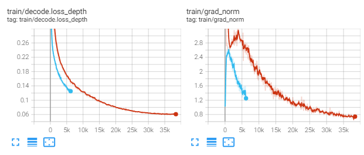

## Train a model

TIE-KD implements distributed training and non-distributed training, which uses `MMDistributedDataParallel` and `MMDataParallel` respectively.

All outputs (log files and checkpoints) will be saved to the working directory, which is specified by `work_dir` in the config file.

By default we evaluate the model on the validation set after some epoches, you can change the evaluation interval by adding the interval argument in the training config.

```python
evaluation = dict(interval=2)  # This evaluate the model per 2 epoches.
```

**\*Important\***: The default learning rate in config files is for 2 GPUs and 8 img/gpu (batch size = 2x8 = 16). Equivalently, you may also use 8 GPUs and 2 imgs/gpu since all models using cross-GPU SyncBN.

### Train on a single machine

#### Train with a single GPU

official support:

```shell
sh tools/dist_train.sh ${CONFIG_FILE} 1 [optional arguments]
```

experimental support (you may need to set PYTHONPATH):

```shell
python tools/train.py ${CONFIG_FILE} [optional arguments]
```

If you want to specify the working directory in the command, you can add an argument `--work-dir ${YOUR_WORK_DIR}`.


#### Train with multiple GPUs

```shell
sh tools/dist_train.sh ${CONFIG_FILE} ${GPU_NUM} [optional arguments]
```

Optional arguments are:

- `--no-validate` (**not suggested**): By default, the codebase will perform evaluation at every k iterations during the training. To disable this behavior, use `--no-validate`.
- `--work-dir ${WORK_DIR}`: Override the working directory specified in the config file.
- `--resume-from ${CHECKPOINT_FILE}`: Resume from a previous checkpoint file (to continue the training process).
- `--load-from ${CHECKPOINT_FILE}`: Load weights from a checkpoint file (to start finetuning for another task).
- `--deterministic`: Switch on "deterministic" mode which slows down training but the results are reproducible.

Difference between `resume-from` and `load-from`:

- `resume-from` loads both the model weights and optimizer state including the iteration number.
- `load-from` loads only the model weights, starts the training from iteration 0.

An example:

```shell
# checkpoints and logs saved in WORK_DIR=work_dirs/ours_mobile2_adabins/
# If work_dir is not set, it will be generated automatically.
bash ./tools/dist_train.sh configs/students/ours_mobile2_adabins.py 2 --work-dir work_dirs/ours_mobile2_adabins/
```

**Note**: During training, checkpoints and logs are saved in the same folder structure as the config file under `work_dirs/`. Custom work directory is not recommended since evaluation scripts infer work directories from the config file name. If you want to save your weights somewhere else, please use symlink, for example:

```shell
ln -s ${YOUR_WORK_DIRS} ${TIE-KD}/work_dirs
```

#### Launch multiple jobs on a single machine

If you launch multiple jobs on a single machine, e.g., 2 jobs of 4-GPU training on a machine with 8 GPUs, you need to specify different ports (29500 by default) for each job to avoid communication conflict. Otherwise, there will be error message saying `RuntimeError: Address already in use`.

If you use `dist_train.sh` to launch training jobs, you can set the port in commands with environment variable `PORT`.

```shell
CUDA_VISIBLE_DEVICES=0,1,2,3 PORT=29500 sh tools/dist_train.sh ${CONFIG_FILE} 4
CUDA_VISIBLE_DEVICES=4,5,6,7 PORT=29501 sh tools/dist_train.sh ${CONFIG_FILE} 4
```

### Runtime Logs
As default, we utilize to `TextLoggerHook` and `TensorboardImageLoggerHook` to log information during training. 

The former prints log in the shell as:
```shell
2022-04-03 00:29:11,300 - depth - INFO - Epoch [3][1200/1514]   lr: 3.543e-05, eta: 3:13:52, time: 0.357, data_time: 0.009, memory: 15394, decode.loss_depth: 0.1381, loss: 0.1381, grad_norm: 1.4511
2022-04-03 00:29:29,139 - depth - INFO - Epoch [3][1250/1514]   lr: 3.608e-05, eta: 3:13:32, time: 0.357, data_time: 0.009, memory: 15394, decode.loss_depth: 0.1420, loss: 0.1420, grad_norm: 1.5763
```

The later saves loss/acc curves and images in the tensorboard server. After start tensorboard and open the page, you can watch the training process.

<div align=center></div>
 
